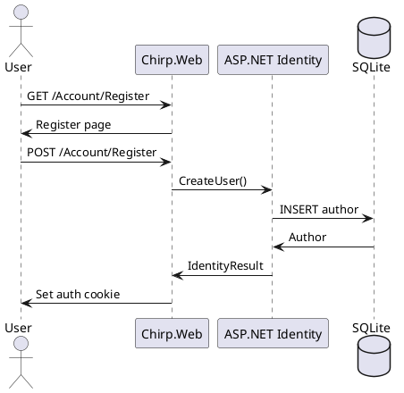
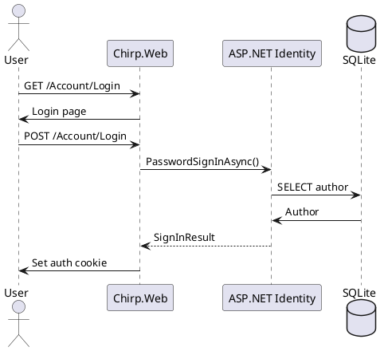
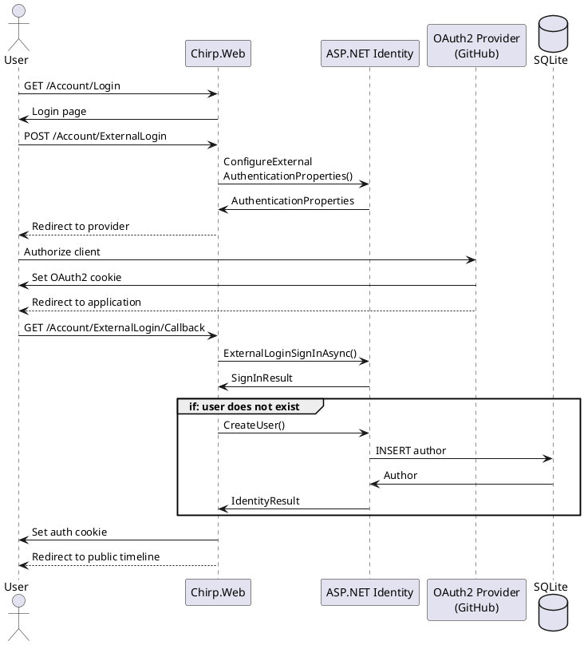
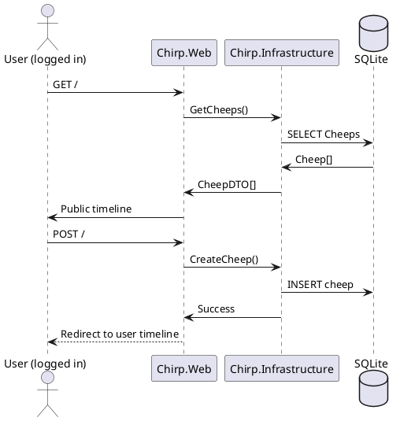

# _Chirp!_ report (Techical documentation)
- August Bugge (aubu)
- Daniel Haubølle (dtha)
- Jonas Esser (jones)
- Jonathan Villeret (jonv)
- Oliver Starup (osta)

## Table of Contents
- Design and architecture
    - Domain Model
    - Architecture - in the small
    - Architecture of deployed application
    - User activities
    - Sequence of functionality/calls through _Chirp!_
- Process
    - Build, test, release, and deployment
    - Team work
    - How to make _Chirp!_ work locally
    - How to run test suite locally
- Ethics
    - License
    - LLMs, ChatGPT, CoPilot, and others

## Design and architecture

### Domain model

```plantUML
@startuml

skin rose

title Classes - Class Diagram

package Identity{
  class IdentityUser<int>
}

package Core {
  class Author {
    +string DisplayName
    +string Email
  }
  
  abstract class Cheep {
    +int CheepId
    +DateTime TimeStamp
    +abstract string GetText()
  }
  class OriginalCheep {
    -string _text
    +override string GetText()
  }
  class ReCheep
}

Author "Author" -- "Cheeps*" Cheep
Author --> "Follows*"Author
Cheep <|-- OriginalCheep
Cheep <|-- ReCheep
OriginalCheep "Content" <-- ReCheep
IdentityUser <|-- Author

@enduml
```


The Domain Model is implemented in the Core package. This contains the classes that represent the core of the data structure.  The core has, by design, very few dependencies. It depends only on Identity. It is the objects defined in the core that are saved in the database.

An Author represents a user of the system. It implements the IdentityUser class to allow for authentication.

A Cheep represents something a user can post. OriginalCheeps represent Cheeps written by the author, while a ReCheep represent repost of an OriginalCheep by another Author.

### Architecture — In the small


Our solution's structure supercedes the Onion structure which means that
each of our dotnet projects does not correspond to a onion layer. Our Core dotnet project correspond to
the core onion layer while the Infrastructure dotnet project is split across both
the repository layer and service layer. In the service layer our DTO's also resides since these are only
used in Chirp.Infrastructure.Services and Chirp.Web. The outermost layer in our structure contains the frontend
razorpages and and the UITests.

### Architecture of deployed application


Illustrate the architecture of your deployed application.
Remember, you developed a client-server application.
Illustrate the server component and to where it is deployed, illustrate a client component, and show how these communicate with each other.

### User activities

Illustrate typical scenarios of a user journey through your _Chirp!_ application.
That is, start illustrating the first page that is presented to a non-authorized user, illustrate what a non-authorized user can do with your _Chirp!_ application, and finally illustrate what a user can do after authentication.

Make sure that the illustrations are in line with the actual behavior of your application.

### Sequence of functionality/calls trough _Chirp!_

### Register



### Login



### Authenticate via GitHub



### Post new cheep



## Process

### Build, test, release, and deployment

Illustrate with a UML activity diagram how your _Chirp!_ applications are build, tested, released, and deployed.
That is, illustrate the flow of activities in your respective GitHub Actions workflows.

Describe the illustration briefly, i.e., how your application is built, tested, released, and deployed.

### Team work

!!THIS NEEDS TO BE DONE!!!! IT HAS TO BE DONE AS ONE OF THE LAST THINGS:!!
Show a screenshot of your project board right before hand-in.
Briefly describe which tasks are still unresolved, i.e., which features are missing from your applications or which functionality is incomplete.
!!THIS NEEDS TO BE DONE!!!! IT HAS TO BE DONE AS ONE OF THE LAST THINGS!!

When the project description comes out, we read it together individually and discuss it as a group, to get a rough idea of how we want to tackle the problems.
Then the description is made into GitHub issues, with user stories and acceptance criteria, and added to the GitHub kanban board.

Later someone will assign themselves to the issue, create a branch and move the issue to “In Progress” on the kanban board.
They will complete the issue and check off the acceptance criteria.
When the issue is complete, and all tests pass, they will move it to “Pre approval” on the kanban board, and create a pull request.

Another developer will review the pull request, and either suggest changes, in which case the original developer fixes the problems, and request a re-review.

When it is approved in review and all tests pass, the branch is merged into main and the issue is moved to “Done” on the kanban board.

```plantuml
start
:Receive Project Description;

:Read indivudually and discuss
as group;

:Someone writes the issue
and it is added to kanban board;

:Someone assigns themselves to the issue
and moves it on the kanban board;

:Complete the issue, and check
the acceptance criteria off;

repeat :Complete an acceptance criteria;
repeat while (More acceptance criteria?) is (yes)
->no;

:Create pull request
and move it on the kanban board;

repeat :Someone reviews the code;
backward:Original developer fixes problems;
repeat while (Review approved and
checks pass?) is (no)
->yes;

:Branch is merged into main
and issue is closed;
end
```

### How to make _Chirp!_ work locally

To run the project you need the following programs

- Dotnet 8
    - [_How to install dotnet_](https://learn.microsoft.com/en-us/dotnet/core/install/) 
- git cli

```sh
git clone https://github.com/ITU-BDSA2024-GROUP14/Chirp.git
```

After cloning the project go into _Chirp.Web_ project
```sh
cd ./Chirp/src/Chirp.Web
```
Run the following command to set up user secrets for running the program locally
```sh
dotnet user-secrets set "authentication:github:clientId" "Ov23liOEFAiXHOnNGkH3"
dotnet user-secrets set "authentication:github:clientSecret" "9cc3aae28d9e5fdfe27f42158842f92687964382"
```

Now run ```dotnet run```. The program is now running locally, go to http://localhost:5273 to interact with it


### How to run test suite locally

#### How to run test suite 

To run the test suite locally playwright and dotnet 8 needs to be installed. To install playwright, make sure powershell is installed. 

- [_How to install powershell_](https://learn.microsoft.com/en-us/powershell/scripting/install/installing-powershell?view=powershell-7.4)
- [_How to install dotnet_](https://learn.microsoft.com/en-us/dotnet/core/install/) 

After installing powershell on your local machine, run the following command in the root of the project
```sh
dotnet build
pwsh ./test/UITests/bin/Debug/net8.0/playwright.ps1
```
After the above listed  programs is installed on your computer, run the following command in the project root to run all tests
```sh
dotnet test
```

#### Tests in _Chirp!_ 
To ensure requirements, prevent bugs, and new code does not break old code, the project contains Unit tests, integration tests, and End to End tests.

These tests can be found in the following folders
```sh
Project root
|-- test
    |-- Chirp.Infrastructure.Tests
    |-- IntegrationTests
    |-- UITests
```

##### Chirp.Infrastructure.Tests  
The _Infrastructure test_ project contains unit tests for

- Cheeprepository
- ChirpService
- AuthorService

These tests cover all of the different methods located in their respective classes.

##### IntegrationTests  
The _intregration test_ project contains integration tests, using http requests to test if the website contains implemented features in the html code.

##### UITests  
In the _UITests_ project playwright has been used to create End to End test for the project. These tests test the UI, and features that are relient on being logged in.

## Ethics

### License

When deciding which license to use the most important consideration is whether any GPL libraries are used in the project, since the licence then must be GPL.
None of the libraries used has the GPL license, or any other copyleft license. 
Therefore the choice of license was left open, and the MIT license was chosen. 
The MIT license is one of the most permissive licenses, allowing the program to be used for almost anything as long as the original copyright notice and license are included. 
This also means the program can be used as is, and the developers have no responsibility for maintaining the product.
As discussed in the open source lecture, there are many advantages with using open source as your license.
Additionally, since this is a school project, it makes sense to both be as open source as possible, and to not take responsibility for maintaining the code longterm.

### LLMs, ChatGPT, CoPilot, and others

In the development process LLM were used sparingly to support the coding process.
Riders Line Completion were occasionally used to finish lines of code, when it came with good suggestions. 
This runs locally and does not communicate over the internet, probably making them use less power compared ChatGPT or similar LLM's.
It assisted making templates for documentation,so it was easy to fill out, and wrote some of the setup code for some of the simpler tests.
ChatGPT was used occasionally to suggest names, explain error messages, and other similar uses.

Often the answers were wrong or irrelevant, especially regarding ChatGPT, however it rarely took long to figure out whether the answer was useful, so it did not waste much time.
It was helpful as support and probably sped up the coding process, but the final product most likely did not change because of it.
Since neither ever contributed significantly[^1] to the codebase it has not been added as a co-author to any commits.


[^1]: It is obviously up to debate when a contribution becomes "significant", so this is just the opinion the group.
