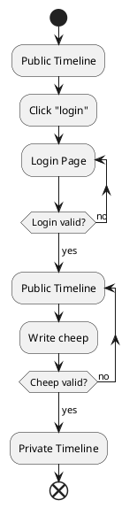
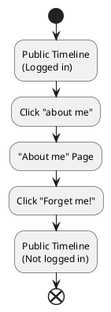

## Design and architecture

### Domain model

Provide an illustration of your domain model.
Make sure that it is correct and complete.
In case you are using ASP.NET Identity, make sure to illustrate that accordingly.

### Architecture — In the small

Illustrate the organization of your code base.
That is, illustrate which layers exist in your (onion) architecture.
Make sure to illustrate which part of your code is residing in which layer.

### Architecture of deployed application

Illustrate the architecture of your deployed application.
Remember, you developed a client-server application.
Illustrate the server component and to where it is deployed, illustrate a client component, and show how these communicate with each other.

### User activities

Illustrate typical scenarios of a user journey through your _Chirp!_ application.
That is, start illustrating the first page that is presented to a non-authorized user, illustrate what a non-authorized user can do with your _Chirp!_ application, and finally illustrate what a user can do after authentication.

Make sure that the illustrations are in line with the actual behavior of your application.

Unregistered users start on the public timeline and can either register or login to become a authorized user. 
They can also view the cheeps on the public timeline, change page, and view other users private timeline, by clicking on their names.
Once authorized you can do the same as an unauthorized user, but in a addition they can write new cheeps, follow other users, or recheep their cheeps. 
They can also view their information under "about me", and in there they can also use the "Forget me!" feature to delete all personel information about the user.

User register:
```plantUML
@startuml

start
:Public Timeline
(Not logged in);
:Click "Register";

repeat :Register page
backward:Prints what should 
be changed;
:Fill out register form;
repeat while (Register valid?) is (no)
->yes;

:Public Timeline
(Logged in);

@enduml
```
User Login and Cheep

"Forget me" journey


### Sequence of functionality/calls trough _Chirp!_

With a UML sequence diagram, illustrate the flow of messages and data through your _Chirp!_ application.
Start with an HTTP request that is send by an unauthorized user to the root endpoint of your application and end with the completely rendered web-page that is returned to the user.

Make sure that your illustration is complete.
That is, likely for many of you there will be different kinds of "calls" and responses.
Some HTTP calls and responses, some calls and responses in C# and likely some more.
(Note the previous sentence is vague on purpose. I want that you create a complete illustration.)

## Process

### Build, test, release, and deployment

Illustrate with a UML activity diagram how your _Chirp!_ applications are build, tested, released, and deployed.
That is, illustrate the flow of activities in your respective GitHub Actions workflows.

Describe the illustration briefly, i.e., how your application is built, tested, released, and deployed.

### Team work

Show a screenshot of your project board right before hand-in.
Briefly describe which tasks are still unresolved, i.e., which features are missing from your applications or which functionality is incomplete.

Briefly describe and illustrate the flow of activities that happen from the new creation of an issue (task description), over development, etc. until a feature is finally merged into the `main` branch of your repository.

### How to make _Chirp!_ work locally

There has to be some documentation on how to come from cloning your project to a running system.
That is, Adrian or Helge have to know precisely what to do in which order.
Likely, it is best to describe how we clone your project, which commands we have to execute, and what we are supposed to see then.

### How to run test suite locally

List all necessary steps that Adrian or Helge have to perform to execute your test suites.
Here, you can assume that we already cloned your repository in the step above.

Briefly describe what kinds of tests you have in your test suites and what they are testing.

## Ethics

### License

State which software license you chose for your application.

### LLMs, ChatGPT, CoPilot, and others

State which LLM(s) were used during development of your project.
In case you were not using any, just state so.
In case you were using an LLM to support your development, briefly describe when and how it was applied.
Reflect in writing to which degree the responses of the LLM were helpful.
Discuss briefly if application of LLMs sped up your development or if the contrary was the case.
