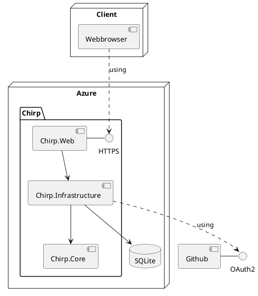
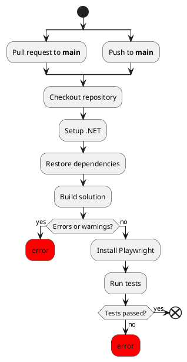
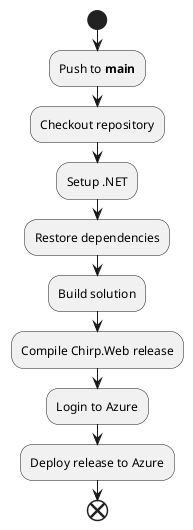

# _Chirp!_ report (Techical documentation)
- August Bugge (aubu)
- Daniel Haubølle (dtha)
- Jonas Esser (jones)
- Jonathan Villeret (jonv)
- Oliver Starup (osta)

## Table of Contents
- Design and architecture
    - Domain Model
    - Architecture - in the small
    - Architecture of deployed application
    - User activities
    - Sequence of functionality/calls through _Chirp!_
    - Design decisions
- Process
    - Build, test, release, and deployment
    - Team work
    - How to make _Chirp!_ work locally
    - How to run test suite locally
- Ethics
    - License
    - LLMs, ChatGPT, CoPilot, and others

## Introduction
The following report was created for the course Analysis, Design and Software Architecture. The report will go into the architecture of the project, design decisions, development project, and specific ethics decisions.

## Design and architecture

### Domain model

```plantUML
@startuml

skin rose

title Classes - Class Diagram

package Identity{
  class IdentityUser<int>
}

package Core {
  class Author {
    +string DisplayName
    +string Email
  }
  
  abstract class Cheep {
    +int CheepId
    +DateTime TimeStamp
    +abstract string GetText()
  }
  class OriginalCheep {
    -string _text
    +override string GetText()
  }
  class ReCheep
}

Author "Author" -- "Cheeps*" Cheep
Author --> "Follows*"Author
Cheep <|-- OriginalCheep
Cheep <|-- ReCheep
OriginalCheep "Content" <-- ReCheep
IdentityUser <|-- Author

@enduml
```


The Domain Model is implemented in the Core package. This contains the classes that represent the core of the data structure.  The core has, by design, very few dependencies. It depends only on Identity. It is the objects defined in the core that are saved in the database.

An Author represents a user of the system. It implements the IdentityUser class to allow for authentication.

A Cheep represents something a user can post. OriginalCheeps represent Cheeps written by the author, while a ReCheep represent repost of an OriginalCheep by another Author.

### Architecture — In the small


Our solution's structure supercedes the Onion structure which means that
each of our dotnet projects does not correspond to a onion layer. Our Core dotnet project correspond to
the core onion layer while the Infrastructure dotnet project is split across both
the repository layer and service layer. In the service layer our DTO's also resides since these are only
used in Chirp.Infrastructure.Services and Chirp.Web. The outermost layer in our structure contains the frontend
razorpages and and the UITests.

### Architecture of deployed application



The _Chirp!_ application is hosted on Azure as an App Service. The Chirp.Web package exposes access to the application through razorpages.
Whenever a client wants to access the app they connect through https to Chirp.Web.
When the client opens the app the Chirp.Web makes a call to Chirp.Infrastructure which acceses the SQLite database.
If the client chooses to they can register and account with OAuth through github in which case github handles this request.

### User activities

Unregistered users start on the public timeline and can either register or login to become a authorized user. 
They can also view the cheeps on the public timeline, change page, and view other users private timeline, by clicking on their names.
Once authorized you can do the same as an unauthorized user, but in a addition they can write new cheeps, follow other users, or recheep their cheeps. 
They can also view their information under "about me", and in there they can also use the "Forget me!" feature to delete all personal information about the user.


Below are two activity diagrams, about authorized and unauthorized users. The internal pages are orange boxes, actions are green boxes, and external pages are blue boxes.

Activity diagram for unauthorized user:


Activity diagram for authorized user:


Here are three user journeys representing typical user experiences on our site.
User registering for the site:
```plantUML
@startuml

start
:Public Timeline
(Not logged in);
:Click "Register";

repeat :Register page
backward:Prints what should 
be changed;
:Fill out register form;
repeat while (Register valid?) is (no)
->yes;

:Public Timeline
(Logged in);

@enduml
```
User logging in and writing a cheep:

User using the "Forget me!" feature to delet all data about them: 


### Sequence of functionality/calls trough _Chirp!_

### Register


### Login


### Authenticate via GitHub


### Post new cheep


### Design decisions

#### Self-contained releases
During the development of Chirp, a decision was made to make releases self-contained. 
It was not a requirement to have self-contained releases, because it is assumed that all interested users can use the application with dotnet 7.0. 
This is not the case for this project, since it uses dotnet 8.0. 
Therefore, it is important for the releases to be self-contained.

In general, it has been decided that emails are unique which means two users with different usernames still cannot have the same email.
We have made the decision to delete the user with the username "Helge" from the production database so that he can register his github account which uses the same email.

#### Onion Architecture

In session 7 of the course, requirement 1.f describes an implementation of an Onion Architecture.
We have chosen not to follow the described structure, because we believe it violates the Onion Architecture.
We have chosen have our *Core* contain the Data Model for our project. This was done, so our *Core* does not depend on any of the other projects.
Ideally, the *Core* would have no dependencies, and represent only the idea of our data structure. Our *Author* class needs to depend on *Identity*, to implement authorization, though.

In our *Infrastructure* layer, we have defined DTOs, repositories and repository interfaces. These are defined here, because they are not directly related to the data model, but to how the data is stored in a database.
Both of these depend on the *Core*. If the DTOs/repository interfaces had been in *Core*, and the Model been in *Infrastructure*, the *Core* would depend on an outer layer, which would have been unacceptable.
We also have Services defined here, that depend on the repositories and DTOs.

Our *Web* project depends on the inner layers.

This enforces the idea of antisymmetric dependencies in the Onion Architecture; all layers in the system only depend on the layers that are deeper in the architecture.

## Process

### Build, test, release, and deployment

**Build & Test**

The `build_and_test.yml` workflow triggers on changes to main and ensures that all tests pass and that no warnings can enter the code base.


**Deploy to Azure**

The `deploytoazure.yml` workflow publishes the `Chirp.Web` Razor application to the Azure App Service to ensure that our production environment is always up to date.



**Publish on tags**

The `publish_on_tags.yml` workflow creates a GitHub release containing the compiled binaries for various systems.

```plantuml
start
:Push tag like **v*.*.***;
:Checkout repository;
:Setup .NET;
:Restore dependencies;
:Build solution;
:Install Playwright;
:Run tests;
:Compile Chirp.Web release for Windows x64;
:Compile Chirp.Web release for Linux x64;
:Compile Chirp.Web release for macOS x64;
:Compile Chirp.Web release for macOS ARM;
:Create GitHub release;
end
```

**Compile report**

The `compile_report.yml` workflow compiles the report and included PlantUML diagrams as PDF.

```plantuml
start
:Push to docs/** path;
:Checkout repository;
:Build docker container;
:Run docker container;
:Compile report;
:Upload PDF as artifact;
end
```

### Team work

!!THIS NEEDS TO BE DONE!!!! IT HAS TO BE DONE AS ONE OF THE LAST THINGS:!!
Show a screenshot of your project board right before hand-in.
Briefly describe which tasks are still unresolved, i.e., which features are missing from your applications or which functionality is incomplete.
!!THIS NEEDS TO BE DONE!!!! IT HAS TO BE DONE AS ONE OF THE LAST THINGS!!

When the project description comes out, we read it together individually and discuss it as a group, to get a rough idea of how we want to tackle the problems.
Then the description is made into GitHub issues, with user stories and acceptance criteria, and added to the GitHub kanban board.

Later someone will assign themselves to the issue, create a branch and move the issue to “In Progress” on the kanban board.
They will complete the issue and check off the acceptance criteria.
When the issue is complete, and all tests pass, they will move it to “Pre approval” on the kanban board, and create a pull request.

Another developer will review the pull request, and either suggest changes, in which case the original developer fixes the problems, and request a re-review.

When it is approved in review and all tests pass, the branch is merged into main and the issue is moved to “Done” on the kanban board.

```plantuml
start
:Receive Project Description;

:Read indivudually and discuss
as group;

:Someone writes the issue
and it is added to kanban board;

:Someone assigns themselves to the issue
and moves it on the kanban board;

:Complete the issue, and check
the acceptance criteria off;

repeat :Complete an acceptance criteria;
repeat while (More acceptance criteria?) is (yes)
->no;

:Create pull request
and move it on the kanban board;

repeat :Someone reviews the code;
backward:Original developer fixes problems;
repeat while (Review approved and
checks pass?) is (no)
->yes;

:Branch is merged into main
and issue is closed;
end
```

### How to make _Chirp!_ work locally

To run the project you need the following programs

- Dotnet 8
    - [_How to install dotnet_](https://learn.microsoft.com/en-us/dotnet/core/install/) 
- git cli

```sh
git clone https://github.com/ITU-BDSA2024-GROUP14/Chirp.git
```

After cloning the project go into _Chirp.Web_ project
```sh
cd ./Chirp/src/Chirp.Web
```
Run the following command to set up user secrets for running the program locally
```sh
dotnet user-secrets set "authentication:github:clientId" "Ov23liOEFAiXHOnNGkH3"
dotnet user-secrets set "authentication:github:clientSecret" / 
"9cc3aae28d9e5fdfe27f42158842f92687964382"
```

Now run ```dotnet run```. The program is now running locally, go to http://localhost:5273 to interact with it[^2]


[^2]: Pushing secrets like these to a public github repo is a bad idea. They are added here to make it easier to run the program, without having to create your own Github OAuth token, and the program _Chirp!_ is not important enough for this to be a problem.

### How to run test suite locally

#### How to run test suite 

To run the test suite locally playwright and dotnet 8 needs to be installed. To install playwright, make sure powershell is installed. 

- [_How to install powershell_](https://learn.microsoft.com/en-us/powershell/scripting/install/installing-powershell?view=powershell-7.4)
- [_How to install dotnet_](https://learn.microsoft.com/en-us/dotnet/core/install/) 

After installing powershell on your local machine, run the following command in the root of the project
```sh
dotnet build
pwsh ./test/UITests/bin/Debug/net8.0/playwright.ps1
```
After the above listed  programs is installed on your computer, run the following command in the project root to run all tests
```sh
dotnet test
```

#### Tests in _Chirp!_ 
To ensure requirements, prevent bugs, and new code does not break old code, the project contains Unit tests, integration tests, and End to End tests.

These tests can be found in the following folders
```sh
Project root
|-- test
    |-- Chirp.Infrastructure.Tests
    |-- IntegrationTests
    |-- UITests
```

##### Chirp.Infrastructure.Tests  
The _Infrastructure test_ project contains unit tests for

- Cheeprepository
- ChirpService
- AuthorService

These tests cover all of the different methods located in their respective classes.

##### IntegrationTests  
The _intregration test_ project contains integration tests, using http requests to test if the website contains implemented features in the html code.

##### UITests  
In the _UITests_ project playwright has been used to create End to End test for the project. These tests test the UI, and features that are relient on being logged in.

## Ethics

### License

When deciding which license to use the most important consideration is whether any GPL libraries are used in the project, since the licence then must be GPL.
None of the libraries used has the GPL license, or any other copyleft license. 
Therefore the choice of license was left open, and the MIT license was chosen. 
The MIT license is one of the most permissive licenses, allowing the program to be used for almost anything as long as the original copyright notice and license are included. 
This also means the program can be used as is, and the developers have no responsibility for maintaining the product.
As discussed in the open source lecture, there are many advantages with using open source as your license.
Additionally, since this is a school project, it makes sense to both be as open source as possible, and to not take responsibility for maintaining the code longterm.

### LLMs, ChatGPT, CoPilot, and others

In the development process LLM were used sparingly to support the coding process.
Riders Line Completion were occasionally used to finish lines of code, when it came with good suggestions. 
This runs locally and does not communicate over the internet, probably making them use less power compared ChatGPT or similar LLM's.
It assisted making templates for documentation,so it was easy to fill out, and wrote some of the setup code for some of the simpler tests.
ChatGPT was used occasionally to suggest names, explain error messages, and other similar uses.

Often the answers were wrong or irrelevant, especially regarding ChatGPT, however it rarely took long to figure out whether the answer was useful, so it did not waste much time.
It was helpful as support and probably sped up the coding process, but the final product most likely did not change because of it.
Since neither ever contributed significantly[^1] to the codebase it has not been added as a co-author to any commits.


[^1]: It is obviously up to debate when a contribution becomes "significant", so this is just the opinion the group.
